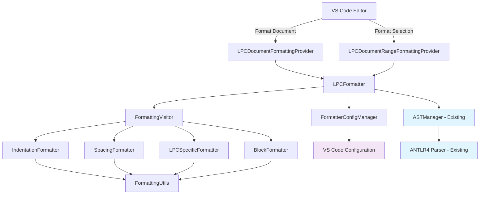

# Design Document: LPC Code Formatter

## Overview

LPC Code Formatter是一个专为LPC语言设计的代码格式化工具，集成到现有的LPC Support VS Code扩展中。该工具利用现有的ANTLR4语法解析器基础设施，提供智能的代码格式化功能，支持LPC语言的独特语法特性，如函数指针、映射类型、foreach循环、范围匹配等。

格式化器采用访问者模式遍历抽象语法树(AST)，应用预定义的格式化规则，生成符合编码规范的代码输出。

## Steering Document Alignment

### Technical Standards (tech.md)
- 遵循项目的TypeScript严格模式和模块化架构
- 使用现有的ANTLR4解析器基础设施
- 保持与VS Code扩展架构的一致性
- 采用单一职责原则设计各个组件

### Project Structure (structure.md)
- 将格式化功能集成到src目录结构中
- 遵循现有的provider模式（如CompletionProvider、DiagnosticsProvider等）
- 利用现有的AST管理和缓存机制
- 保持与其他语言服务功能的协调性

## Code Reuse Analysis

### Existing Components to Leverage
- **ASTManager**: 复用现有的AST解析和缓存机制，避免重复解析
- **LPCParser/LPCLexer**: 使用ANTLR4生成的语法解析器进行语法树构建
- **ConfigManager**: 复用配置管理系统用于格式化选项配置
- **ErrorListener**: 复用错误处理机制用于格式化过程中的错误管理
- **DebounceUtil**: 复用防抖功能用于实时格式化场景

### Integration Points
- **VS Code Language Server Protocol**: 通过DocumentFormattingProvider和DocumentRangeFormattingProvider集成
- **Extension Activation**: 在extension.ts中注册格式化provider
- **Configuration System**: 与VS Code settings系统集成，提供用户可配置的格式化选项
- **Parse Cache**: 与现有的parseCache系统集成，提高性能

## Architecture

格式化系统采用分层架构，将格式化逻辑分解为独立的、可测试的组件：

### Modular Design Principles
- **Single File Responsibility**: 每个文件专注一个特定的格式化功能领域
- **Component Isolation**: 格式化规则、访问者、配置管理分离实现
- **Service Layer Separation**: 将格式化逻辑、配置管理、VS Code集成分层处理
- **Utility Modularity**: 通用格式化工具函数独立模块化



## Components and Interfaces

### LPCDocumentFormattingProvider
- **Purpose:** VS Code DocumentFormattingProvider接口实现，处理整个文档格式化
- **Interfaces:**
  - `provideDocumentFormattingEdits(document: vscode.TextDocument, options: vscode.FormattingOptions): vscode.TextEdit[]`
- **Dependencies:** LPCFormatter
- **Reuses:** VS Code API标准接口

### LPCDocumentRangeFormattingProvider
- **Purpose:** VS Code DocumentRangeFormattingProvider接口实现，处理选定范围格式化
- **Interfaces:**
  - `provideDocumentRangeFormattingEdits(document: vscode.TextDocument, range: vscode.Range, options: vscode.FormattingOptions): vscode.TextEdit[]`
- **Dependencies:** LPCFormatter
- **Reuses:** VS Code API标准接口

### LPCFormatter
- **Purpose:** 核心格式化引擎，协调各种格式化操作
- **Interfaces:**
  - `formatDocument(document: vscode.TextDocument, options: FormattingOptions): Promise<vscode.TextEdit[]>`
  - `formatRange(document: vscode.TextDocument, range: vscode.Range, options: FormattingOptions): Promise<vscode.TextEdit[]>`
- **Dependencies:** ASTManager, FormatterConfigManager, FormattingVisitor
- **Reuses:** 现有的ASTManager和错误处理机制

### FormattingVisitor
- **Purpose:** AST访问者，遍历语法树并应用格式化规则
- **Interfaces:**
  - `visit(node: ParseTree): FormattedResult`
  - `visitChildren(node: RuleNode): FormattedResult`
- **Dependencies:** IndentationFormatter, SpacingFormatter, LPCSpecificFormatter, BlockFormatter
- **Reuses:** ANTLR4 Visitor模式

### IndentationFormatter
- **Purpose:** 处理代码缩进格式化
- **Interfaces:**
  - `formatIndentation(node: ParseTree, currentLevel: number): string`
  - `calculateIndentLevel(node: ParseTree): number`
- **Dependencies:** FormattingUtils
- **Reuses:** 通用缩进计算逻辑

### SpacingFormatter
- **Purpose:** 处理空格和操作符周围的间距
- **Interfaces:**
  - `formatOperatorSpacing(node: ParseTree): string`
  - `formatPunctuationSpacing(node: ParseTree): string`
- **Dependencies:** FormattingUtils
- **Reuses:** 标准空格处理规则

### LPCSpecificFormatter
- **Purpose:** 处理LPC特有语法的格式化（函数指针、mapping、foreach等）
- **Interfaces:**
  - `formatFunctionPointer(node: ParseTree): string`
  - `formatMapping(node: ParseTree): string`
  - `formatForeach(node: ParseTree): string`
  - `formatRangeCase(node: ParseTree): string`
- **Dependencies:** FormattingUtils
- **Reuses:** LPC语法特性识别逻辑

### BlockFormatter
- **Purpose:** 处理代码块和大括号格式化
- **Interfaces:**
  - `formatBlock(node: ParseTree): string`
  - `formatBraceStyle(node: ParseTree, style: BraceStyle): string`
- **Dependencies:** FormattingUtils
- **Reuses:** 标准块格式化模式

### FormatterConfigManager
- **Purpose:** 管理格式化配置选项
- **Interfaces:**
  - `getFormattingOptions(): FormattingOptions`
  - `updateConfig(key: string, value: any): void`
- **Dependencies:** VS Code Configuration API
- **Reuses:** 现有的ConfigManager模式

### FormattingUtils
- **Purpose:** 通用格式化工具函数集合
- **Interfaces:**
  - `normalizeWhitespace(text: string): string`
  - `preserveComments(original: string, formatted: string): string`
  - `calculateTextEdits(original: string, formatted: string): vscode.TextEdit[]`
- **Dependencies:** 无
- **Reuses:** 标准字符串处理工具

## Data Models

### FormattingOptions
```typescript
interface FormattingOptions extends vscode.FormattingOptions {
  // 继承VS Code标准选项: insertSpaces, tabSize

  // LPC特定选项
  braceStyle: 'allman' | 'k&r' | 'gnu' | 'whitesmiths';
  spacesAroundOperators: boolean;
  spacesInsideParentheses: boolean;
  spacesInsideBrackets: boolean;
  alignMappingValues: boolean;
  preserveArrayFormatting: boolean;
  maxLineLength: number;
  indentSwitchCase: boolean;
  alignParameters: boolean;
}
```

### FormattedResult
```typescript
interface FormattedResult {
  text: string;
  range: vscode.Range;
  preserveLeadingWhitespace: boolean;
  preserveTrailingWhitespace: boolean;
}
```

### BraceStyle
```typescript
enum BraceStyle {
  Allman = 'allman',        // 大括号换行
  KAndR = 'k&r',           // 大括号不换行
  GNU = 'gnu',             // GNU风格
  Whitesmiths = 'whitesmiths' // Whitesmiths风格
}
```

## Error Handling

### Error Scenarios
1. **语法解析错误:** 当代码包含语法错误时
   - **Handling:** 捕获解析异常，记录错误位置，对可解析部分进行格式化
   - **User Impact:** 显示错误信息，保持原始代码不变的区域高亮显示

2. **格式化配置无效:** 当用户配置包含无效选项时
   - **Handling:** 使用默认配置值，记录警告日志
   - **User Impact:** 显示配置警告，使用默认格式化规则

3. **大文件处理超时:** 当处理超大文件时
   - **Handling:** 设置处理超时限制，分块处理大文件
   - **User Impact:** 显示处理进度，允许用户取消操作

4. **内存不足:** 当处理超大文件导致内存问题时
   - **Handling:** 实施内存监控，启用流式处理模式
   - **User Impact:** 显示内存警告，建议分批处理

## Testing Strategy

### Unit Testing
- **格式化规则测试:** 测试各种语法结构的格式化输出
- **配置管理测试:** 测试不同配置选项的正确应用
- **边界情况测试:** 测试空文件、超大文件、特殊字符等边界情况
- **LPC特殊语法测试:** 测试函数指针、映射、foreach等LPC特有语法

### Integration Testing
- **VS Code集成测试:** 测试与VS Code编辑器的集成功能
- **AST管理器集成测试:** 测试与现有AST解析系统的协作
- **配置系统集成测试:** 测试与VS Code设置系统的集成
- **性能测试:** 测试格式化性能和内存使用

### End-to-End Testing
- **完整格式化流程测试:** 从用户触发到格式化完成的完整流程
- **多文件项目测试:** 测试在实际LPC项目中的格式化效果
- **用户体验测试:** 测试格式化速度、错误恢复、配置便利性等用户体验
- **回归测试:** 确保格式化结果的一致性和幂等性