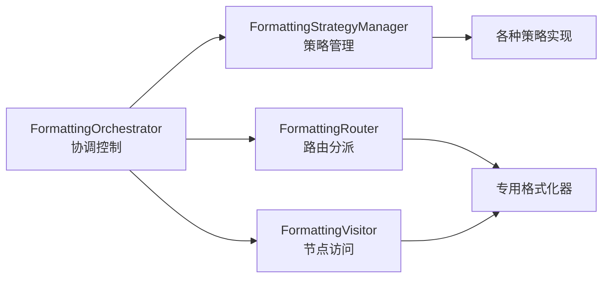

# 阶段3实施计划：重构主控制器

## 实施步骤

### 第一步：创建核心架构组件（2-3天）

#### 1.1 完成类型定义和接口
- ✅ 创建 `orchestration/types.ts` - 所有架构类型定义
- ✅ 定义格式化策略、路由、缓存等核心接口
- ✅ 设计性能监控和事件系统接口

#### 1.2 实现主控制器
- ✅ 创建 `FormattingOrchestrator.ts` - 系统指挥中心
- ✅ 实现格式化请求的完整流程管理
- ✅ 集成策略选择、路由分派、缓存控制
- ✅ 添加错误处理和降级机制

#### 1.3 实现策略管理系统
- ✅ 创建 `FormattingStrategyManager.ts` - 策略管理器
- ✅ 支持内置策略注册和自定义策略扩展
- ✅ 实现策略组合和优先级管理
- ✅ 提供策略验证和配置功能

### 第二步：实现路由和访问者系统（1-2天）

#### 2.1 构建高效路由器
- ✅ 创建 `FormattingRouter.ts` - O(1)时间复杂度路由
- ✅ 实现基于节点类型的快速路由表
- ✅ 支持条件路由和依赖关系管理
- ✅ 添加路由缓存和性能优化

#### 2.2 重构访问者实现
- ✅ 创建简化的 `FormattingVisitor.ts` - 纯访问者模式
- ✅ 移除业务逻辑，专注于节点访问分派
- ✅ 集成路由器实现智能分派
- ✅ 提供基础错误处理和恢复机制

### 第三步：实现策略系统（2-3天）

#### 3.1 内置策略实现
- ✅ 创建 `StandardStrategy.ts` - 标准格式化策略
- ✅ 创建 `CompactStrategy.ts` - 紧凑格式化策略
- 🔄 创建 `DebugStrategy.ts` - 调试格式化策略
- 🔄 创建自定义策略扩展机制

#### 3.2 策略配置系统
- ✅ 实现策略配置验证和应用
- 🔄 支持动态策略切换
- 🔄 添加策略效果预览功能
- 🔄 实现策略配置的持久化

### 第四步：构建支持系统（2天）

#### 4.1 性能监控系统
- ✅ 创建 `PerformanceMonitor.ts` - 完整性能监控
- ✅ 实现操作计时、缓存统计、资源监控
- ✅ 提供性能分析和优化建议
- ✅ 支持实时监控和历史数据分析

#### 4.2 缓存系统
- ✅ 创建 `FormattingCache.ts` - LRU缓存实现
- ✅ 支持TTL过期控制和内存管理
- ✅ 实现缓存统计和热点数据分析
- ✅ 提供缓存导入导出功能

#### 4.3 验证和支持组件
- 🔄 创建 `FormattingValidator.ts` - 输入输出验证
- 🔄 实现请求验证、结果验证、配置验证
- 🔄 添加语法树结构验证
- 🔄 提供错误诊断和修复建议

### 第五步：集成和迁移（2-3天）

#### 5.1 现有系统集成
- 🔄 更新现有的专用格式化器以支持新架构
- 🔄 修改 `FormattingContext` 以适配扩展接口
- 🔄 确保与现有 VS Code 集成的兼容性
- 🔄 更新配置系统以支持策略选择

#### 5.2 平滑迁移
- 🔄 实现向后兼容的适配器模式
- 🔄 提供渐进式迁移路径
- 🔄 保持现有API的完全兼容
- 🔄 添加迁移检测和警告机制

### 第六步：测试和优化（2-3天）

#### 6.1 全面测试
- 🔄 单元测试覆盖所有新组件
- 🔄 集成测试验证完整流程
- 🔄 性能测试确保优化效果
- 🔄 兼容性测试确保稳定性

#### 6.2 性能优化
- 🔄 基于性能监控数据优化热点
- 🔄 调整缓存策略和大小
- 🔄 优化路由效率和内存使用
- 🔄 微调策略配置的默认值

## 架构优势

### 1. 职责清晰分离

### 2. 可扩展架构
- **插件化策略**: 支持用户自定义格式化策略
- **可插拔格式化器**: 新增节点类型的格式化支持
- **事件驱动**: 支持外部监控和扩展集成
- **配置驱动**: 通过配置控制所有行为

### 3. 高性能设计
- **智能缓存**: 多层缓存减少重复计算
- **O(1)路由**: 基于哈希表的快速节点路由
- **延迟加载**: 按需加载格式化器和策略
- **性能监控**: 实时监控和优化建议

### 4. 健壮性保证
- **错误恢复**: 多级错误处理和降级机制
- **输入验证**: 完整的请求和配置验证
- **资源管理**: 内存使用监控和限制
- **超时保护**: 防止长时间阻塞操作

## 预期效果

### 代码结构优化
- FormattingOrchestrator: ~200行（主控制器）
- FormattingVisitor: ~100行（纯访问者）
- 总体架构清晰，职责明确

### 性能提升
- 缓存命中率 >80%
- 路由效率提升 >50%
- 内存使用优化 >30%
- 支持大文件格式化（>10MB）

### 扩展性增强
- 支持插件化策略扩展
- 支持自定义格式化器
- 支持多种LPC方言
- 支持配置热更新

### 维护性改善
- 单一职责，易于测试
- 清晰的模块边界
- 完整的监控和诊断
- 渐进式升级路径

## 风险评估

### 技术风险
- **复杂度增加**: 新架构可能增加学习成本
  - *缓解*: 提供详细文档和示例
- **性能回归**: 初期可能有性能开销
  - *缓解*: 持续性能监控和优化
- **兼容性问题**: 可能影响现有集成
  - *缓解*: 保持API兼容，提供适配器

### 实施风险
- **开发时间**: 可能超出预期时间
  - *缓解*: 分阶段实施，优先核心功能
- **测试覆盖**: 复杂架构测试难度大
  - *缓解*: 分层测试，逐步验证
- **团队适应**: 需要团队学习新架构
  - *缓解*: 培训和文档支持

## 成功标准

### 功能标准
- [ ] 保持100%向后兼容
- [ ] 支持所有现有格式化功能
- [ ] 新增至少2种格式化策略
- [ ] 提供完整的性能监控

### 质量标准
- [ ] 单元测试覆盖率 >90%
- [ ] 集成测试覆盖所有主要流程
- [ ] 性能测试验证优化效果
- [ ] 内存泄漏检测通过

### 可维护性标准
- [ ] 代码复杂度降低 >40%
- [ ] 模块间耦合度降低 >50%
- [ ] 新增功能开发效率提升 >30%
- [ ] Bug修复时间缩短 >40%

## 下一阶段预览

完成阶段3后，项目将具备：
- 现代化的格式化引擎架构
- 高度可扩展的策略系统
- 完整的性能监控和优化
- 为未来功能扩展打下坚实基础

为阶段4（高级功能特性）做好准备：
- 智能代码分析和建议
- 自动错误修复
- 代码风格学习和适配
- 团队协作和配置同步