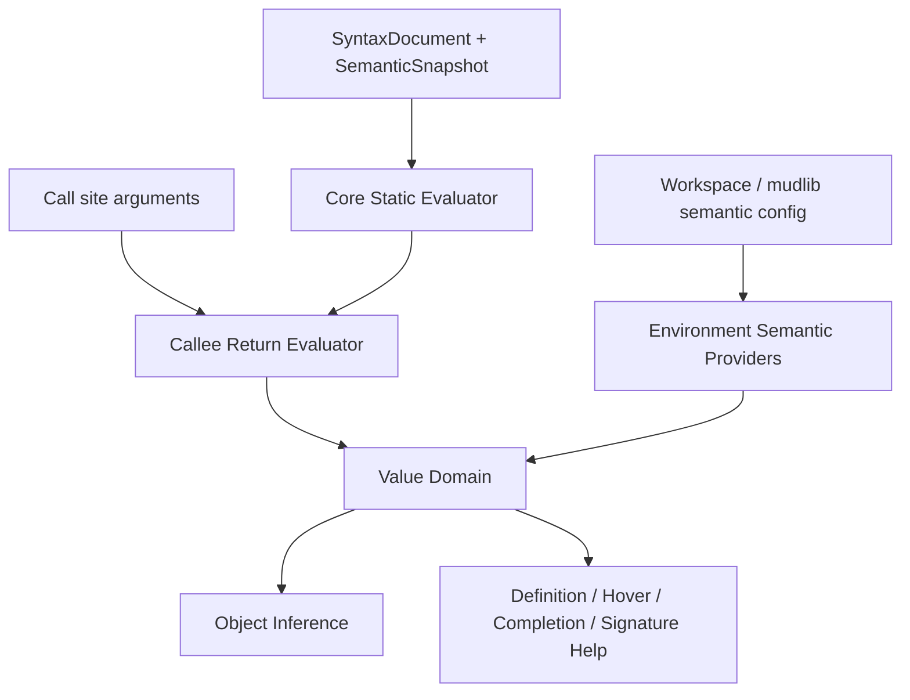

# LPC Semantic Evaluation Foundation Design

## 1. 概述

当前 `lpc-support` 已经具备稳定的 parser / syntax / semantic 主链：

- parser 真源：
  - [`ParsedDocumentService.ts`](/D:/code/lpc-support/src/parser/ParsedDocumentService.ts)
- syntax 真源：
  - [`SyntaxBuilder.ts`](/D:/code/lpc-support/src/syntax/SyntaxBuilder.ts)
- semantic 真源：
  - [`SemanticModelBuilder.ts`](/D:/code/lpc-support/src/semantic/SemanticModelBuilder.ts)

因此，插件已经不是“依赖正则暴力理解 LPC 结构”的状态。它可以稳定理解：

- `if / else`
- `switch / case`
- `for / while / foreach`
- 函数、参数、局部变量
- `->` / `::`
- `new(...)`
- array / mapping / struct / class 等语法结构

但当前对象推导、返回对象推导仍然存在一个核心短板：

**插件对“结构”理解已经较强，但对“值如何在函数内传播、如何通过 callee 的 return 返回、如何表达静态 mapping 形状”理解仍然偏弱。**

这会直接表现为：

- `PROTOCOL_D->model_get("login")->error_result(...)`
  - 可以识别这是方法链
  - 但无法自然推导 `model_get("login")` 实际返回哪个 model 对象
- 当前只能依赖 `@lpc-return-objects` 给出候选集合
- 一旦场景变成：
  - 局部变量别名
  - registry mapping
  - 简单 if/else 分支
  - wrapper/helper 函数返回对象
  - 对象推导精度就明显受限

本 spec 的目标不是继续给 `ObjectInferenceService` 叠加特判，而是正式定义一层新的长期基础设施：

**LPC 受限语义求值层（Semantic Evaluation Foundation）**

对象推导器、definition、hover、completion、signature help 将逐步成为这层能力的消费者，而不再各自维护分散的“返回对象/候选对象”规则。

## 2. 问题陈述

### 2.1 当前主问题不是“无法识别语法”，而是“无法自然求值”

以真实场景 [`adm/protocol/protocol_server.c`](D:/code/shuiyuzhengfeng_lpc/adm/protocol/protocol_server.c) 为例：

```c
object model_get(string model_name, mixed init_arg) {
    mapping registry = query_model_registry();
    mapping info = registry[model_name];
    object model;

    if (info["mode"] == "new")
        model = new(info["path"]);
    else
        model = load_object(info["path"]);

    return model;
}
```

当前问题并不在于插件“不知道这里有 `if`、有 mapping、有 return”，而在于：

- 不能把调用点 `"login"` 绑定到 callee 的 `model_name`
- 不能把 `registry["login"]` 自然收敛到静态子 mapping
- 不能把 `info["path"]` / `info["mode"]` 收敛到静态值
- 不能沿 `return model` 把对象来源自然带回调用点

因此 `model_get` 只能依赖 `@lpc-return-objects` 返回一个宽泛候选列表。

### 2.2 继续在对象推导器中叠加函数特判会制造新技术债

当前对象推导主链已经较复杂，核心入口包括：

- [`ObjectInferenceService.ts`](/D:/code/lpc-support/src/objectInference/ObjectInferenceService.ts)
- [`ReturnObjectResolver.ts`](/D:/code/lpc-support/src/objectInference/ReturnObjectResolver.ts)
- [`ReceiverTraceService.ts`](/D:/code/lpc-support/src/objectInference/ReceiverTraceService.ts)

如果继续在这些对象推导组件内直接增加：

- `model_get` 特判
- registry 特判
- 某些 helper / daemon / wrapper 的返回值特判

则未来一定会演化为更大的“函数返回对象特判集合”，并继续制造：

- 返回值规则分散
- 与 `@lpc-return-objects` 的优先级混乱
- 无法复用于非对象 consumer
- 不易定义理论边界

### 2.3 当前系统缺少统一的“值域模型”

现在系统里已经有多套近似但不统一的结果模型：

- 对象候选
- `@lpc-return-objects`
- builtin receiver 特例
- `this_player()` 这类配置驱动候选

但还没有一套统一的 Value Domain 去表达：

- 精确值
- 多候选值
- 配置注入候选
- 不可静态闭包值
- 静态 mapping / array 形状

这使得新能力很难以基础设施形式成长。

## 3. 目标与非目标

### 3.1 目标

- 定义 `lpc-support` 的长期语义求值基础设施，而不是继续补对象推导特判
- 正式区分：
  - 核心静态求值
  - 环境语义建模
  - 对象推导 consumer
- 定义统一的 Value Domain，能够表达：
  - `exact`
  - `candidate-set`
  - `configured-candidate-set`
  - `unknown`
  - `non-static`
- 定义 `callee return` 的自然推导骨架
- 明确 `@lpc-return-objects` 的未来定位：
  - 保留
  - 兼容
  - fallback
  - 不再是 authority

### 3.2 非目标

本 spec **不** 做以下事情：

- 不直接实现完整解释器
- 不承诺所有 LPC 运行时语义都可静态求值
- 不承诺完整循环求值、完整容器别名分析、完整跨函数固定点分析
- 不在本轮修改用户可见产品行为
- 不直接替换现有 `ObjectInferenceService`
- 不废弃 `@lpc-return-objects`
- 不把 `this_player()`、`environment()`、`previous_object()` 强行塞进同一条求值链

## 4. 静态语义边界模型

本项目未来不应使用“能分析 / 不能分析”的粗分法，而应使用下列四层静态边界：

### 4.1 精确静态层

这类语义目标是长期精确支持。

典型例子：

- `load_object("/adm/daemons/combat_d")`
- `new(PATH_MACRO)`，且宏能静态展开
- 局部变量别名
- 简单 `if/else`
- 静态 mapping literal
- `registry["login"]["path"]`
- 受限 callee `return`

### 4.2 有限候选层

这类不一定能得到唯一实例身份，但可收敛成有限候选集合。

典型例子：

- `this_object()`
- 某些 `environment(ob)`，若容器候选受限
- 某些 `find_player("foo")`、`find_living("foo")` 的 archetype 候选

### 4.3 配置建模层

这类不来自源码闭包，但可以通过项目配置 / mudlib 约定提供语义候选。

典型例子：

- `this_player()`
  - 当前项目中已由 `playerObjectPath` 进行弱建模
- 未来可能的：
  - user/body archetype
  - room/container archetype
  - 某些 driver 注入对象

### 4.4 非静态闭包层

这类应被长期定义为：

**不承诺静态精确推导。**

典型例子：

- `previous_object()`

它依赖调用栈历史，超出静态源码闭包。

### 4.5 设计原则

未来语义层必须原生支持以下结果语义：

- `exact`
- `candidate-set`
- `configured-candidate-set`
- `unknown`
- `non-static`

不能继续假设所有对象推导最终都必须收敛为“唯一对象路径”。

## 5. 方案对比

### 5.1 不推荐方案：继续增强 Object Inference 特判

做法：

- 在 [`ObjectInferenceService.ts`](/D:/code/lpc-support/src/objectInference/ObjectInferenceService.ts) 与 [`ReturnObjectResolver.ts`](/D:/code/lpc-support/src/objectInference/ReturnObjectResolver.ts) 中继续增加：
  - `model_get` 特判
  - registry 特判
  - wrapper/helper 特判

优点：

- 短期快

缺点：

- 继续把“返回值语义”绑定死在对象推导器上
- 新函数场景会持续复制特判
- 无法服务 completion / hover / callable return 等其他 consumer
- 技术债会继续累计

### 5.2 推荐方案：独立出语义求值层

做法：

- 独立定义 Value Domain
- 建立 Core Static Evaluator
- 建立 Callee Return Evaluator
- 建立 Environment Semantic Providers
- 让对象推导器退为 consumer

优点：

- 架构最稳
- `model_get`、wrapper factory、daemon helper、路径 factory 都可复用
- 可以自然承接 `configured-candidate-set`
- `@lpc-return-objects` 的 fallback 语义可统一定义

缺点：

- 前期设计和迁移成本更高

### 5.3 不推荐方案：先强化环境语义，再回头做 return 推导

做法：

- 先集中做 `this_player()`、`find_player()`、`environment()` 一类环境语义
- 之后再处理 `model_get` / `return`

优点：

- 某些 builtin 场景体感会较快提升

缺点：

- 无法优雅解决当前最核心的 `model_get/query_model_registry` 问题
- 底层值域模型仍会被继续拖延

### 5.4 结论

本 spec 采用 **5.2 推荐方案**：

**下一阶段真正建设的是 `LPC Semantic Evaluation Foundation`，不是继续堆对象推导规则。**

## 6. 总体架构

长期结构建议拆成五层：

1. `Value Domain`
2. `Core Static Evaluator`
3. `Callee Return Evaluator`
4. `Environment Semantic Providers`
5. `Consumers`

其中：

- `ObjectInferenceService`
  - 未来是 consumer
- definition / hover / completion / signature help
  - 未来也是 consumer

### 6.1 总体关系图



## 7. Value Domain

Value Domain 必须围绕“LPC 静态可求值结果”而设计，而不是围绕“对象候选”单独设计。

### 7.1 核心值类型

建议至少包含：

- `UnknownValue`
  - 当前阶段无法证明
- `NonStaticValue`
  - 本质依赖运行时历史/世界状态，超出静态闭包
- `LiteralValue`
  - string / int / float / char / path-like literal
- `ObjectValue`
  - exact object path / candidate object paths / configured candidate paths
- `MappingShapeValue`
  - 静态 mapping 形状
- `ArrayShapeValue`
  - 静态 array 形状
- `UnionValue`
  - 多分支 / 多候选合并

### 7.2 设计约束

- 不能继续维持“对象候选一套模型、return 结果另一套模型”的分裂状态
- `configured-candidate-set` 必须是一等结果，不得继续靠 ad-hoc builtin 特判模拟
- `NonStaticValue` 必须与 `UnknownValue` 分开

### 7.3 `model_get` 场景上的值流

理想值流：

- `model_name`
  - `LiteralValue("login")`
- `registry`
  - `MappingShapeValue`
- `registry[model_name]`
  - 取出静态子 mapping
- `info["path"]`
  - `LiteralValue("/adm/protocol/model/login_model")`
- `return model`
  - `ObjectValue(exact path)`

## 8. Core Static Evaluator

Core Static Evaluator 不是完整解释器，而是：

**在单个源码闭包内，对 Syntax + Semantic 做受限抽象求值。**

### 8.1 输入

- `SyntaxDocument`
- `SemanticSnapshot`
- `EvaluationContext`
  - 当前函数
  - 当前文档
  - 初始形参绑定
  - 预算/深度
- `EvaluationState`
  - 当前局部环境
  - 当前分支控制状态

### 8.2 核心状态

建议至少包含：

- `ValueEnvironment`
  - `symbol -> Value`
- `ControlFlowState`
  - 可达性 / return 状态 / 分支终止信息
- `ReturnAccumulator`
  - 所有可达 `return` 的值集合

### 8.3 工作方式

建议采用：

- `evaluateExpression(node, state) -> Value`
- `transferStatement(node, state) -> EvaluationState[]`
- `joinStates(states) -> EvaluationState`

即以抽象 transfer/join 形式构建，而不是 ad-hoc 的变量追踪脚本。

### 8.4 P1 白区能力

Core Static Evaluator 的第一阶段白区建议支持：

- 局部变量声明
- 赋值
- 局部别名传播
- `if/else`
- 条件表达式 `?:`
- `return`
- 静态 mapping literal
- 固定 key 索引
- 静态 array literal
- `new(...)`
- `load_object(...)`
- `find_object(...)`

### 8.5 P1 明确不支持

第一阶段应保守退为 `unknown` / `non-static` 的场景包括：

- 任意循环后的精确值
- 任意递归 / 大范围跨函数固定点
- 任意动态容器构造与别名修改
- 完整字符串求值
- `ref` 反向修改传播

## 9. Callee Return Evaluator

其职责不是对象推导，而是：

**在调用点与被调函数之间建立受限静态调用语义桥。**

### 9.1 职责

- 解析当前 call expression 的目标函数
- 将调用点实参值绑定到 callee 形参
- 在 callee 内调用 Core Static Evaluator 求 `return`

### 9.2 输入

- 调用点 document / syntax node
- callee 函数声明/定义节点
- 调用点实参 `Value[]`
- 调用预算 / 深度预算

### 9.3 输出

- `FunctionReturnEvaluationResult`
  - 主结果仍然是 `Value`
  - 附带：
    - 是否 fallback
    - 是否超预算
    - 是否命中 `non-static`

### 9.4 设计约束

- 必须内建预算边界：
  - 最大跨函数深度
  - 最大语句数
  - 最大 union 大小
- 不能尝试无限追踪任意 helper 链

### 9.5 `model_get` 的定位

`model_get/query_model_registry` 是 Callee Return Evaluator 的首批黄金样例：

- 调用点有静态字符串 key
- callee 内是静态 registry mapping
- return 最终由 `new/load_object` 构成

因此它属于 Core Static Evaluator + Callee Return Evaluator 的最佳基准场景，而不是对象推导器特例。

## 10. Environment Semantic Providers

该层负责：

**把源码闭包外但可通过项目配置 / mudlib 约定建模的语义，正规化注入 Value Domain。**

### 10.1 职责边界

它不负责：

- 普通局部变量求值
- 普通函数 return 推导
- mapping 形状分析
- control flow

它只负责：

- 特定 builtin / runtime-like 表达式
- 在当前工作区语义配置下给出候选值

### 10.2 结果要求

其输出必须仍然落在 Value Domain 中：

- `ConfiguredCandidateSetValue`
- `UnknownValue`
- `NonStaticValue`

不能自行维护另一套结果模型。

### 10.3 provider registry 形式

不建议写成单个巨型 `if builtinName === ...`。

建议抽象为：

- `EnvironmentSemanticProvider`
  - `canHandle(expression)`
  - `evaluate(expression, workspaceContext) -> Value`

后续 provider 可包括：

- `ThisPlayerProvider`
- `RuntimeCallStackProvider`
- `FindPlayerProvider`
- `EnvironmentProvider`

### 10.4 现有先例

当前项目中，`this_player()` 已经存在弱配置建模先例：

- [`ReturnObjectResolver.ts`](/D:/code/lpc-support/src/objectInference/ReturnObjectResolver.ts)
- `playerObjectPath`

但它目前还不是一等 Value Domain 结果，而只是 builtin 特例。  
未来应将其迁移到 Environment Semantic Providers。

## 11. `@lpc-return-objects` 的长期定位

### 11.1 保留

`@lpc-return-objects` 需要保留。

理由：

- 总会存在灰区/黑区函数
- 现有项目与用户代码已经在使用它
- 对 IDE 来说，它仍是有效的保守候选上界

### 11.2 降级

但它必须从“主真相”降级为：

- fallback
- weak semantic contract
- compatibility layer

### 11.3 优先级规则

未来统一规则建议为：

1. 自然语义推导结果
2. 环境语义 provider 结果
3. `@lpc-return-objects`
4. `unknown`

### 11.4 冲突规则

若自然推导与注解冲突：

- 以可证明结果为准
- 长期可考虑增加 `annotation mismatch` 诊断

## 12. 与现有系统的关系

### 12.1 Object Inference

未来 `ObjectInferenceService` 应逐步退为 consumer：

- 不再自己定义“某函数返回对象”的真相
- 消费语义求值层给出的 `Value`
- 再转换为 definition / hover / completion 所需对象候选

### 12.2 现有 parser / syntax / semantic 主链

本 spec 不重写：

- [`ParsedDocumentService.ts`](/D:/code/lpc-support/src/parser/ParsedDocumentService.ts)
- [`SyntaxBuilder.ts`](/D:/code/lpc-support/src/syntax/SyntaxBuilder.ts)
- [`SemanticModelBuilder.ts`](/D:/code/lpc-support/src/semantic/SemanticModelBuilder.ts)

语义求值层应建立在这些现有稳定基础设施之上，而不是另造一套文本分析链。

## 13. 分阶段路线

### 13.1 Phase 0：理论边界与 Value Domain

- 固化黑区 / 灰区 / 白区
- 定义 Value Domain
- 定义 `@lpc-return-objects` fallback 语义

### 13.2 Phase 1：Core Static Evaluator 白区实现

优先支持：

- 局部变量别名
- 静态字符串/路径字面量
- 简单 `if/else`
- 静态 mapping literal
- 固定 key 索引
- `new/load_object/find_object`

### 13.3 Phase 2：Callee Return Evaluator

优先样例：

- `model_get/query_model_registry`
- wrapper/helper 工厂函数
- 单步 factory return helper

### 13.4 Phase 3：Environment Semantic Providers

优先样例：

- `this_player()`

再视价值逐步扩展：

- `find_player()`
- `find_living()`
- 某些 archetype 约定

## 14. 测试与验收方向

未来对应保护网建议至少包括：

- Value Domain 单测
- Core Static Evaluator 单函数求值单测
- Callee Return Evaluator 跨函数 return 单测
- Environment Provider 单测
- `ObjectInferenceService` consumer 集成测试
- 真实 `model_get/query_model_registry` fixture 回归
- `@lpc-return-objects` fallback / mismatch 回归

## 15. 结论

未来真正要建设的，不是“对象推导器增强”，而是：

**LPC 受限语义求值层。**

它的长期职责是：

- 在源码闭包内做受限静态求值
- 在环境配置边界上做受控语义建模
- 统一 Value Domain
- 让对象推导、definition、hover、completion、signature help 逐步从中消费结果

这样：

- `model_get/query_model_registry` 可以自然进入主语义链
- `this_player()` 一类配置建模语义有正式归属
- `previous_object()` 这类非静态黑区也有清晰结果语义
- `@lpc-return-objects` 得以保留，但不会继续阻塞语义层成长
